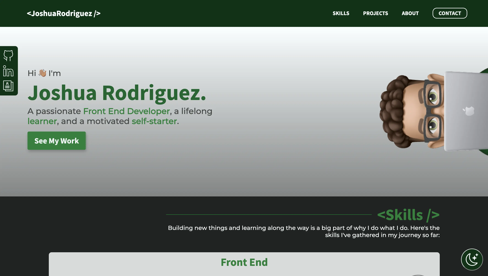
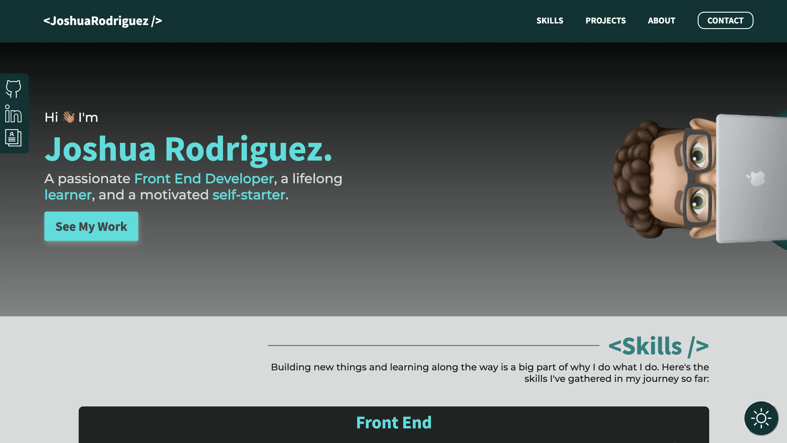

# Joshua Rodriguez Portfolio

This project contains the code for Joshua Rodriguez's portfolio website.  It was built using [TypeScript](https://www.typescriptlang.org/) and [React](https://reactjs.org/), using React's [Context API](https://reactjs.org/docs/context.html/) as a state management tool.  

#### Table of Contents

- [How It's Built](#how-its-built)
  - [Utility Components](#utility-components)
  - [Layout Components](#layout-components)
  - [Custom Hooks](#custom-hooks)
  - [Light and Dark Theme](#light-and-dark-theme)
- [Updates For The Future](#updates-for-the-future)

## How It's Built

Overall, the project was broken down into very simple and reusable utility components; these component's only purpose was to display a certain item onto the screen (a heading, or an icon, for example).  These utility components would then be used by layout components, whose purpose was to display a section of the website.  A simple use of the React Context API (useContext hook) was used to toggle between a light and dark theme, and multiple hooks were made to be able to control components responsively using JavaScript media queries.

### Utility Components

In total, there were 15 different utility components that covered basic user interface materials, everything from buttons to forms to icons and navigation bars.  Each was designed in such a way that when using the utility component, the user could have granular control over the details of said component -- the text size, font colors, and much more were available to be specified, as well as the ability to add any extra CSS classes if needed.  This was done because several of the components were indeed reusable, but had varying properties unique to their specific occurrence.

The overall effect of building these utility components was the speed in which the project put itself together after they were built.  A big portion of otherwise reused CSS rules and HTML structures were avoided, allowing for a seamless dev experience where I could focus mostly on positioning elements instead of directly styling them.  This also assures that in the future, the process of adding to the portfolio will be as effortless as possible.

### Layout Components

The main layout components regarded dealing with the header and footer of the site, as well as the herobox, the skills section, the project section, each project modal section (that appears when the user clicks the 'More Info' button), the about section, and the contact section.  They fully utilize the created utility components to their fullest extent, allowing them to be put together very quickly and seamlessly.  The process of building these components was aided greatly by the existence of all the utility components!

### Custom Hooks

Whenever creating the utility components and with their granular control capabilities in mind, it was necessary to create some media queries that created JavaScript media queries.  The two hooks were named useMQuery and useStandardMQueries, respectively.

The useMQuery hook returns a boolean value that tells the user whether or not the viewport meets the given media query.  For example, if the hook was fed `(min-width: 37.5em)` (600px), the boolean value would be true if the viewport was 600 pixels or higher, and would return false if the viewport did not meet the 600 pixel requirement.  These boolean values I used to plug ternary conditions into various options of different utility components (such as text-size options).  This allowed me to create simple statments that acted as media queries.

Throughout the development process, I came to rely on a specific few media queries in a vast amount of layout components.  In order to avoid code duplication, the useStandardMQueries hook was born, where the most commonly used useMQuery calls were stored into specific variable names.  Whenever I needed to use them, I would simply pull out the boolean values from this useStandardMQueries hook, and I was good to go.

### Light and Dark Theme

The Light and Dark Theme was created using the React Context API.  After creating a simple context that provided a boolean value that stated whether or not the Dark Theme was activated, as well as a toggle function that toggled this boolean value, I was able to bring it into every component that needed to know about the Light / Dark Theme and use that boolean to conditionally render certain colors based on the theme.  

## Updates For The Future

- Light / Dark Theme Refactor
  - At the current moment, I'd like to refactor the way that the light and dark mode themes function.  I think it would be a lot more efficient if instead of giving a boolean value, the context were to give components a set of color variables that would be used throughout the entire application.  Then, a function could be used to toggle the definitions of these variables.  For example, the context could provide a 'BACKGROUND_COLOR' variable, and the definition of that variable would change when the function was called.  This would allow the components to not worry about it's definition, and instead just plug the variable where it needs it.  I think the advantage to this approach would be that it would make editing these colors a lot more efficient and seamless.
